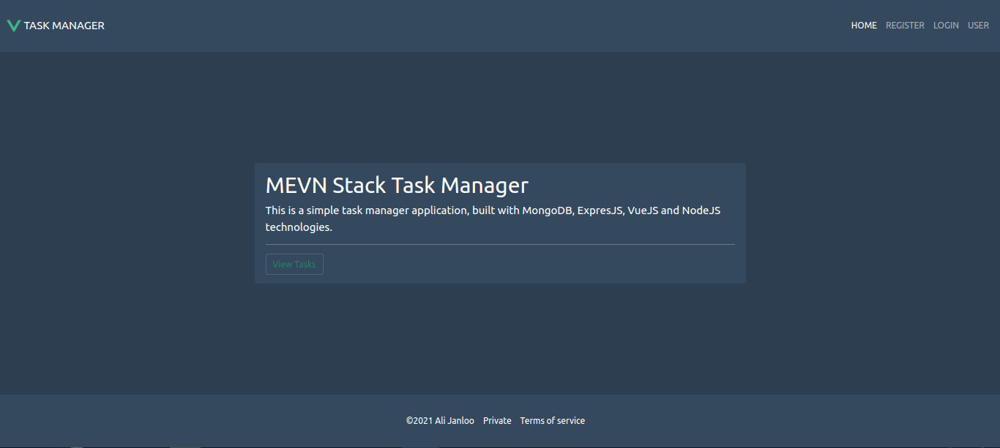
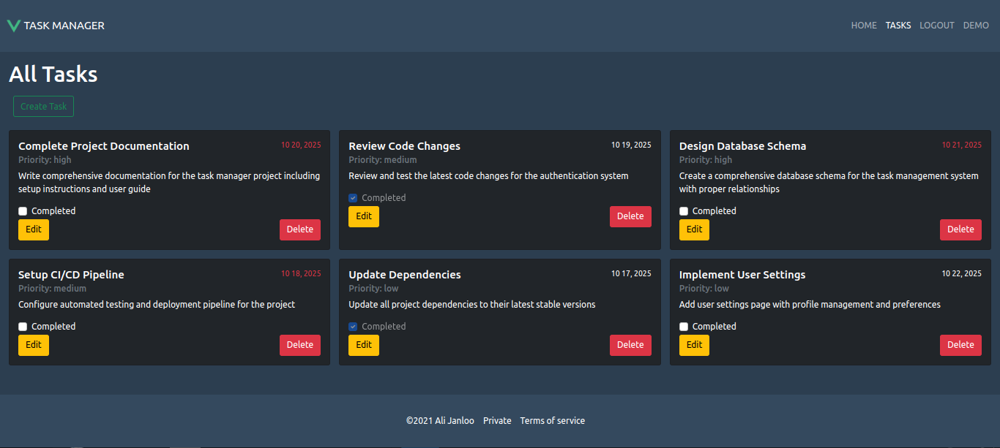

# MEVN Stack Task Manager

A full-stack task management application built with MongoDB, Express.js, Vue.js 3, and Node.js.




## 🚀 Features

- **User Authentication**: JWT-based login and registration system
- **Task Management**: Create, read, update, and delete tasks
- **Responsive Design**: Bootstrap Vue components for mobile-friendly UI
- **State Management**: Vuex for centralized application state
- **Routing**: Vue Router for single-page application navigation
- **RESTful API**: Express.js backend with MongoDB integration

## 🛠️ Tech Stack

### Frontend
- **Vue.js 3** - Progressive JavaScript framework
- **Vue Router 4** - Official router for Vue.js
- **Vuex 4** - State management pattern + library
- **Bootstrap Vue** - Bootstrap components for Vue.js
- **Axios** - HTTP client for API requests

### Backend
- **Node.js** - JavaScript runtime environment
- **Express.js** - Web application framework
- **MongoDB** - NoSQL database
- **Mongoose** - MongoDB object modeling
- **JWT** - JSON Web Tokens for authentication
- **bcrypt** - Password hashing

## 🔧 Installation

1. **Clone the repository**
   ```bash
   git clone https://github.com/Alijanloo/task-manager.git
   cd task-manager
   ```

2. **Install dependencies**
   ```bash
   npm install
   ```

3. **Set up MongoDB**
   - Install MongoDB on your system
   - Start MongoDB service
   - The application will connect to `mongodb://localhost:27017/dev-db` by default

## 🏃‍♂️ Running the Application

### Development Mode (Frontend + Backend)
```bash
npm run dev
```
This command runs:
- Vue.js frontend on `http://localhost:8081`
- Node.js backend on `http://localhost:3000`
- Auto-compilation with Babel
- Hot reload for both frontend and backend

### Frontend Only
```bash
npm run serve
```
Runs only the Vue.js development server on `http://localhost:8081`

### Backend Only
```bash
npm run nodemon
```
Runs only the Node.js server on `http://localhost:3000`

## 🏗️ Build for Production

### Build frontend assets
```bash
npm run build
```

### Start production server
```bash
npm start
```

## 🧹 Code Quality

### Lint and fix files
```bash
npm run lint
```

## 📁 Project Structure

```
task-manager/
├── dev-server/              # Development server source
│   ├── api/                 # API routes and controllers
│   ├── config/              # Database and environment config
│   ├── model/               # MongoDB models
│   └── services/            # Business logic services
├── prod-server/             # Production server (compiled)
├── public/                  # Static assets
├── src/                     # Vue.js source code
│   ├── components/          # Vue components
│   ├── router/              # Vue Router configuration
│   ├── services/            # API service layer
│   ├── store/               # Vuex store
│   └── views/               # Page components
├── package.json             # Dependencies and scripts
└── README.md               # Project documentation
```

## 🔑 Environment Variables

The application uses the following environment variables:

- `NODE_ENV`: Set to 'development' or 'production'
- `DB_URL`: MongoDB connection string
- `TOKEN_SECRET`: JWT secret key

## 🌐 API Endpoints

### Authentication
- `POST /api/auth/login` - User login
- `POST /api/auth/register` - User registration

### Tasks
- `GET /api/tasks` - Get all tasks
- `POST /api/tasks` - Create new task
- `PUT /api/tasks/:id` - Update task
- `DELETE /api/tasks/:id` - Delete task

### Users
- `GET /api/users/profile` - Get user profile
- `PUT /api/users/profile` - Update user profile


## 📝 License

This project is licensed under the MIT License - see the [LICENSE](LICENSE) file for details.
